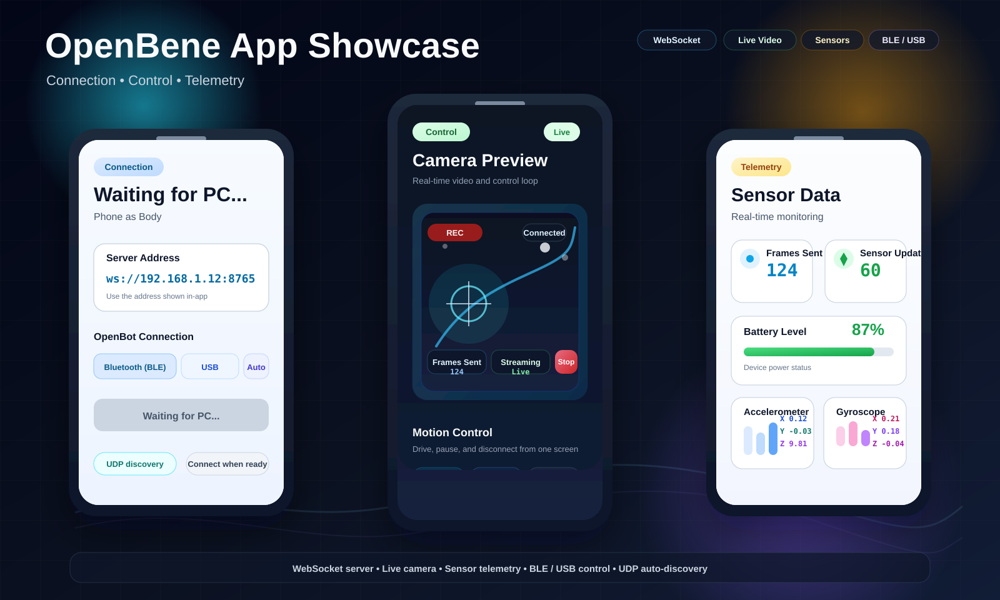

# OpenBene

<p align="center">
  
  
  <a href="https://github.com/HeyBene/OpenBene/discussions">
    
  </a>
</p>

<p align="center"><strong>Languages:</strong> English | <a href="README.zh-CN.md">Simplified Chinese</a></p>

<p align="center"><strong>Phone as Body, PC as Brain</strong> - a public platform-layer toolkit for OpenBot-style robots.</p>

> Scope note:
> `OpenBene` is the public platform-layer repository.
> ROS2, mapping, localization, and other internal mobility work are promoted here selectively after cleanup.
> See [docs/OPENBENE_SCOPE.md](docs/OPENBENE_SCOPE.md) for the boundary.

## Overview

OpenBene focuses on reusable platform capabilities:

- Python SDK for robot control
- Phone app workflows for OpenBot-style robots
- WebSocket connectivity and discovery
- Video, sensor, and recording support
- BLE manual-control utilities for ESP32/OpenBot workflows

## App Showcase

<p align="center">
  
</p>

This preview shows the imported robot app now living in `apps/robot_app/`:

- connection state and `Server Address`
- live `Camera Preview`
- `Sensor Data` with `Frames Sent`, `Sensor Updates`, `Battery Level`, `Accelerometer`, and `Gyroscope`
- WebSocket, UDP auto-discovery, and BLE / USB control paths

## Start Here

- PC-side Python control: [openbene_sdk/README.md](openbene_sdk/README.md)
- Mobile app UI: [openbot-mobile-control/README.md](openbot-mobile-control/README.md)
- Imported robot app: [apps/robot_app/README.md](apps/robot_app/README.md)
- Repo map and migration boundaries: [docs/architecture.md](docs/architecture.md)

## Workspace Areas

- Mainline public surfaces: `openbene_sdk/`, `openbot-mobile-control/`, `apps/robot_app/`, `openbot/`, `docs/`
- App area: `apps/` for self-contained Flutter projects
- Auxiliary local workspaces: `openbene_mobility/`, `openbene_local/`

## Architecture

```text
PC (Python SDK) -> WebSocket -> Phone App -> USB/BLE -> Robot Controller -> Motors
```

## Quick Start

Before you start:

- Python `3.8+`
- phone and PC on the same local network
- the phone app shows `Waiting for PC...`
- the phone app shows a valid `Server Address`

### 1. Prepare the phone app

If you are working from source, the existing Flutter app lives in `openbot-mobile-control/`, and the imported robot app lives in `apps/robot_app/`.

If an Android build is included for your release, start here:

- [openbot-mobile-control/releases/README.md](openbot-mobile-control/releases/README.md)

Important:

- Always use the server address shown inside the app UI.
- On iOS, confirm Local Network permission is enabled for the app.

### 2. Install the Python SDK

```bash
cd openbene_sdk
pip install -e .
```

### 3. Run the full demo

```bash
cd openbene_sdk/examples
python full_demo.py
```

The demo can guide you through:

- manual phone IP connection
- auto-discovery connection
- motion control
- video preview
- sensor reading
- data recording

### 4. Try the basic examples

```bash
python basic_control.py
python interactive_control.py
python video_display.py
python video_recording_demo.py
python data_collection.py
python test_udp_discovery.py
python diagnose.py <phone_ip>
```

For Windows BLE manual control to ESP32/OpenBot firmware:

- [docs/WINDOWS_BLE_CONTROL_RUNBOOK.md](docs/WINDOWS_BLE_CONTROL_RUNBOOK.md)

### 5. Quick troubleshooting

1. Confirm the phone and PC are on the same subnet.
2. Use the app's displayed `Server Address`; do not guess the IP manually.
3. On Windows, verify the WebSocket port:

```powershell
Test-NetConnection -ComputerName <phone_ip> -Port 8765
```

4. If `PingSucceeded=True` but `TcpTestSucceeded=False`, disable VPN/proxy/TUN and retry.
5. On iOS, check:
   `Settings -> Privacy & Security -> Local Network -> OpenBene = ON`

## Project Structure

```text
OpenBene/
- docs/                   # Public documentation and runbooks
- openbene_sdk/           # Python SDK
  - src/                  # Core SDK code
  - examples/             # Example scripts
  - tests/                # SDK tests
- openbot/                # Firmware / hardware baseline
- openbot-mobile-control/ # Existing Flutter mobile app
- apps/
  - robot_app/            # Imported robot-side Flutter app
- openbene_mobility/      # Auxiliary local mobility workspace
- openbene_local/         # Auxiliary scratch/private workspace
- README.md               # English README (default)
- README.zh-CN.md         # Simplified Chinese README
- PROJECT_CONTEXT.md      # Compatibility pointer
- CHANGELOG.md            # Changelog
```

## Documentation

- [docs/architecture.md](docs/architecture.md) - Canonical architecture and newcomer map
- [openbene_sdk/README.md](openbene_sdk/README.md) - SDK documentation
- [apps/robot_app/README.md](apps/robot_app/README.md) - Imported robot app documentation
- [openbot-mobile-control/releases/README.md](openbot-mobile-control/releases/README.md) - Android build and release notes
- [docs/WINDOWS_BLE_CONTROL_RUNBOOK.md](docs/WINDOWS_BLE_CONTROL_RUNBOOK.md) - Windows BLE control workflow
- [docs/OPENBENE_SCOPE.md](docs/OPENBENE_SCOPE.md) - Public scope boundary
- [docs/MOBILITY_SYNC_RULES.md](docs/MOBILITY_SYNC_RULES.md) - Rules for promoting internal mobility work into public OpenBene
- [PROJECT_CONTEXT.md](PROJECT_CONTEXT.md) - Compatibility pointer
- [CHANGELOG.md](CHANGELOG.md) - Changelog

## Contributing

We welcome contributions.

- [Report Bug](https://github.com/HeyBene/OpenBene/issues/new?template=bug_report.yml)
- [Feature Request](https://github.com/HeyBene/OpenBene/issues/new?template=feature_request.yml)
- [Contributing Guide](CONTRIBUTING.md)
- [GitHub Discussions](https://github.com/HeyBene/OpenBene/discussions)

## Acknowledgments

This project builds on:

- [OpenBot](https://github.com/isl-org/OpenBot) - open-source robot platform by Intel ISL

## License

MIT License. See [LICENSE](LICENSE).
